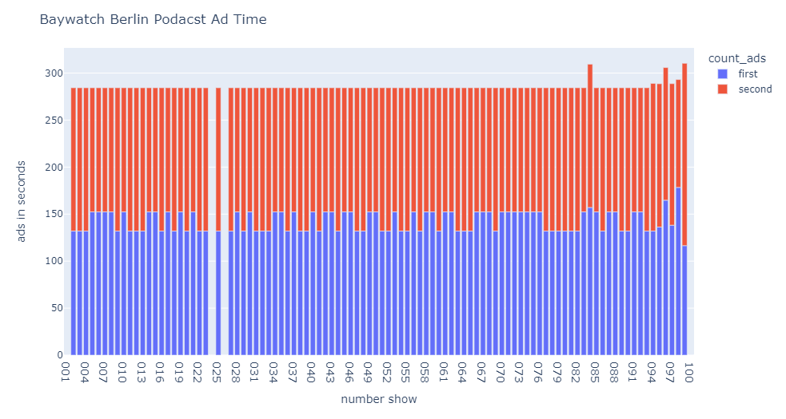
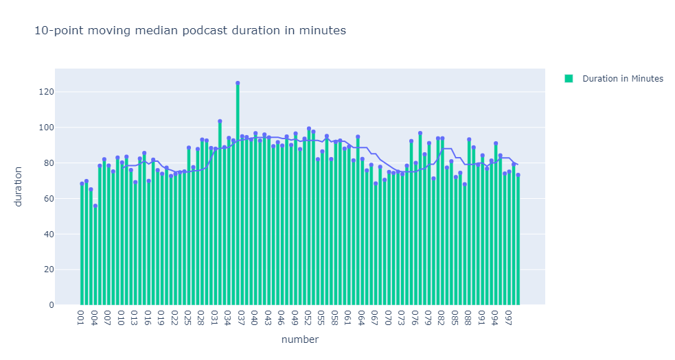

# Analyse des Podcasts 'Baywatch Berlin'

[*** english below ***](README.md#analysis-of-the-podcast-baywatch-berlin)

# Einleitung

Der Markt der Podcasts ist in den letzten Jahren stark gewachsen. Viele neue Podcasts treffen auf viele neue Hörer.
Dies ermöglicht auch einen Podcasts zu vermarkten und in dessen Werbung zu schalten.
Dies macht auch der Podcast von Klaas Heufer-Umlauf, Thomas Schmitt und Jakob Lundt, genannt 'Baywatch Berlin'.
Die Werbeeinblendungen sind klar vom Content durch einen Insert getrennt.

# Ziel

Durch diesen Insert, sollte es einfach sein den Anfang und Ende der Werbeeinblendungen klar herauszufiltern.
So kann einfach der Insert aus einer Folge herausgeschnitten werden, und in allen Folgen gesucht werden

# Vorgehenweise

Hier werden die einzelnen Schritte beschrieben wie vorgegangen worden ist.

## Recherche

Als Grundlage wird die Python Programmiersprache genutzt. Als IDE wird Jupyter mit Anaconda hergenommen.
Es sollte eine möglich einfacher herangehensweise genutzt werden.
Nach kurzer Recherche wurde eine Stackoverflow Antwort gefunden die nützlich sein könnte.
https://stackoverflow.com/a/67469084

Diese Antwort wurde angepasst und auf diesen Use Case zugeschnitten.

## MP3 Dateien umformatieren

[Jupyter Datei: format mp3 to wav](format_mp3_to_wav.ipynb)

Für die Analyse mussten die Dateien in das wav Format gebracht werden.

Für eine geringere Datei Größe und eine schnellere Bearbeitung wurden vorher die Dateien zu einer kleineren mp3 Datei konvertiert:

mp3 Original --> mp3 kleinere Bitrate --> wav

## Werbung Timestamp finden

[Jupyter Datei: extract ad timestamps](extract_ad_timestamps.ipynb)

Das [Snippet](https://stackoverflow.com/a/67469084) wurde hier angepasst und verwendet.
Einzig die Korrelationswerte mussten angepasst werden, die steuert ab wann ein Übereinstimmung markiert wird.
Da nur die Daten gespeichert wurden, sind die Grafiken auch nicht notwendig und wurden entfernt.

## Analyse der Timestamps

[Jupyter Datei: analyze ad timestamps](analyze_ad_timestamps.ipynb)

Für die Analyse wurden die Daten aufbereitet und mit plotly dargestellt.

## Analyse der Metadaten

[Jupyter Datei: analyze episodes metadata](analyze_episodes_metadata.ipynb)

Für die Analyse der Metadaten wurden diese von den mp3s ausgelesen.
Dargestellt wurde die Laufzeit je Episode sowie die Laufzeit der Episode mit einer Trendlinie

# Ergebnis

## Werbung

Schlussendlich wurde das Ziel erreicht und die Timestamps konnten erfolgreich herausgelesen werden.
Bei der Auswertung wurde deutlich dass es immer zwei Werbeblöcke gibt.
Erstaunlicherweise beträgt die Summe dieser Blöcke so gut wie immer 284 Sekunden.
Die zwei Blöcke setzen sich zusammen aus einem 152 sekündigen und einem 132 sekündigen Block.
Ob zuerst der lange oder der kurze Block kommt, ist unterschiedlich.
Seit Folge 94 ist die jedoch anscheinend nicht mehr der Fall.
Die Auswertung hatte am 24.10.2021 statt gefunden. Die Werbeblöcke sind so konstant, dass einiges darauf hin deutet, dass die Blöcke im Nachhinein geändert wurden.
Die Veträge mit Werbepartner gehen üblicherweise nicht lange, so dass später die Werbeblöcke noch ausgetauscht werden.
Da die letzten Folgen nicht konstant sind deutet ebenfalls darauf hin, da hier noch die 'original' Werbeblöcke enthalten sind.

## Metadata

Die Länge der Folgen hat auch an Volatilität zugenommen.
Zwischen Folge 30 und 66 waren die Folgen meist rund 90 Minuten lang.
So konsequent sind diese Ergebisse nicht und die Folgenlänge schwankt stark zwischen 93 und 67 Minuten.

## Jakobs Seufzer

In der Folge 'Das Gottesteilchen von Cala Ratata' wurde das erste mal ein Seufzer von Jakob eingespielt.
Dieser wurde öfters wiederholt.
[Hier eine Liste mit allen Seufzer](jakob_clean.csv)

# Analysis of the podcast 'Baywatch Berlin

# Introduction

The podcast market has grown strongly in recent years. Many new podcasts meet many new listeners.
This also makes it possible to market podcasts and place advertisements in them.
The podcast by Klaas Heufer-Umlauf, Thomas Schmitt and Jakob Lundt, called 'Baywatch Berlin', also does this.
The advertisements are clearly separated from the content by an insert.

# Goal

Through this insert, it should be easy to clearly filter out the beginning and end of the commercials.
This way, the insert can simply be cut out of an episode and searched for in all episodes.

# Procedure

Here the individual steps are described how to proceed.

## Research

The Python programming language is used as the basis. Jupyter with Anaconda is used as the IDE.
The approach should be as simple as possible.
After a short search, a Stackoverflow answer was found that could be useful.
https://stackoverflow.com/a/67469084

This answer was adapted and tailored to this use case.

## Reformatting MP3 files

[Jupyter File: format mp3 to wav](format_mp3_to_wav.ipynb)

For the analysis, the files had to be converted to wav format.

For a smaller file size and faster processing, the files were converted to a smaller mp3 file beforehand:

mp3 original --> mp3 smaller bitrate --> wav

## Find advertising timestamp

[Jupyter File: analyze ad timestamps](analyze_ad_timestamps.ipynb)

The [snippet](https://stackoverflow.com/a/67469084) was adapted and used here.
Only the correlation values had to be adapted, which controls when a match is marked.
Since only the data was saved, the graphics are not necessary and were removed.

## Analysis of the timestamps

[Jupyter File: analyze ad timestamps](analyze_ad_timestamps.ipynb)

For the analysis, the data was prepared and displayed with plotly.

## Analysis of the metadata

[Jupyter File: analyze episodes metadata](analyze_episodes_metadata.ipynb)

For the analysis of the metadata, these were read from the mp3s.
The running time per episode as well as the running time of the episode with a trend line was displayed.

# Result

## Ads

Finally, the goal was achieved and the timestamps could be read out successfully.
During the evaluation it became clear that there are always two commercial breaks.
Surprisingly, the sum of these blocks is almost always 284 seconds.
The two blocks consist of a 152-second block and a 132-second block.
Whether the long or the short block comes first varies.
Since episode 94, however, this is apparently no longer the case.
The evaluation had taken place on 24.10.2021. The advertising blocks are so constant that there are indications that the blocks were changed afterwards.
The contracts with advertising partners usually do not last long, so that the advertising blocks are exchanged later.
The fact that the last episodes are not constant also indicates that the 'original' advertising blocks are still included.

## Metadata

The length of the episodes has also increased in volatility.
Between episode 30 and 66, the episodes were usually around 90 minutes long.
These results are not that consistent and the episode length fluctuates greatly between 93 and 67 minutes.

## Jacob's sigh

In the episode 'The God Particle of Cala Ratata' a sigh of Jacob was recorded for the first time.
This was repeated several times.
[Here is a list of all the sighs](jakob_clean.csv)